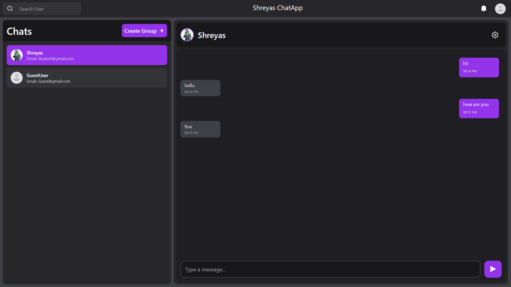
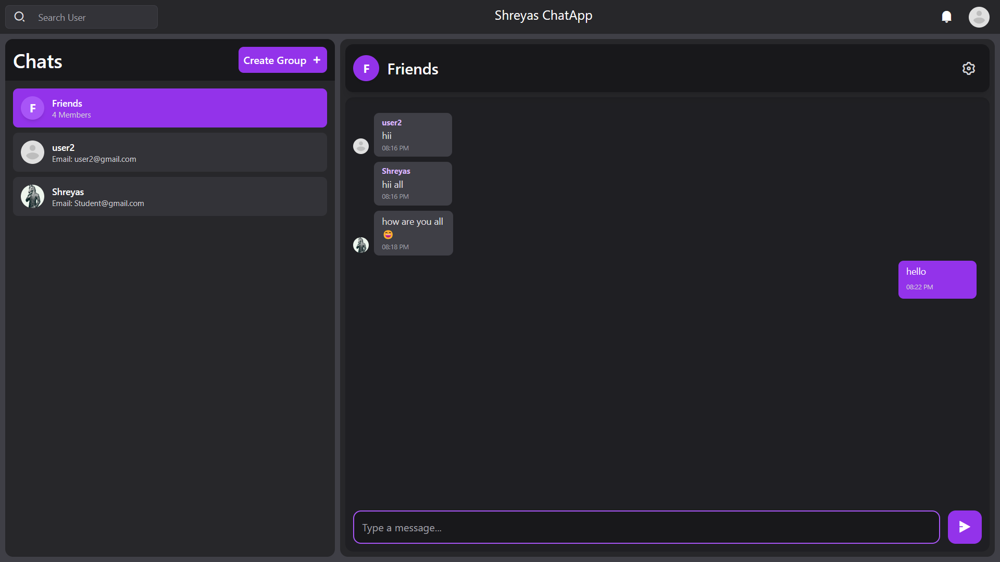
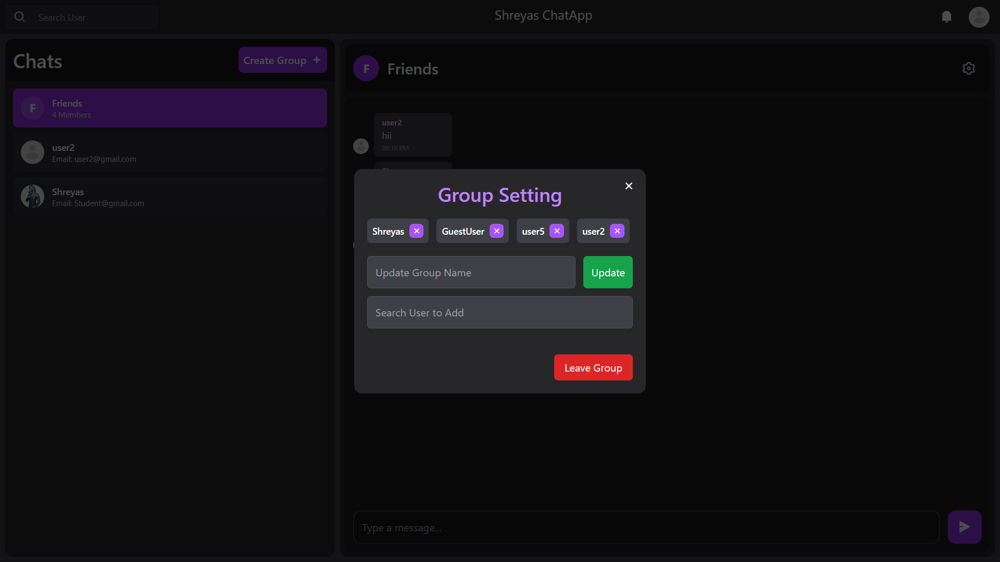

# Chat App 💬

A powerful real-time chat application designed to enhance communication through private and group chats, built with the MERN stack. TalkHub emphasizes user-friendly features and secure, seamless interactions.

## ✨ Features

### Authentication
- Secure user registration and login.
- JWT token-based authentication ensures safety.
- Profile picture support for personalization.

### Real-time Communication
- Instant message delivery powered by Socket.IO.
- Typing indicators to enhance interaction.
- Message read/unread status for better tracking.
- Real-time notifications for new messages to stay updated.

### Chat Features
- One-on-one private messaging for direct communication.
- Group chat creation and management.
- User search functionality to easily find contacts.
- Message deletion to manage conversations.
- Comprehensive group admin controls:
  - Add or remove members.
  - Change group name.
  - Transfer admin rights.
  - Delete group when needed.

## 🛠️ Tech Stack

### Frontend
  
  
  

### Backend
  
  

### Additional Technologies
- JWT for secure authentication.
- Bcrypt for password hashing.
- Mongoose for MongoDB object modeling.
- CORS for seamless cross-origin resource sharing.

## 🌐 Live Demo
[View Live Demo](https://talkhub-chat.vercel.app/)

## 📱 Screenshots

  
*Main chat interface with real-time messaging.*

  
*Group chat functionality with admin controls.*

  
*Group chat settings for admin controls like adding/removing members.*
